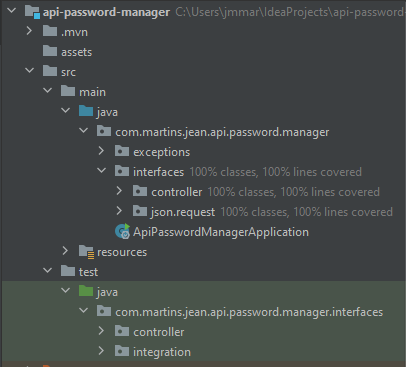
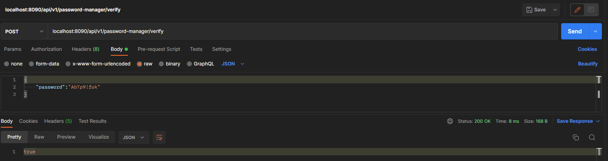
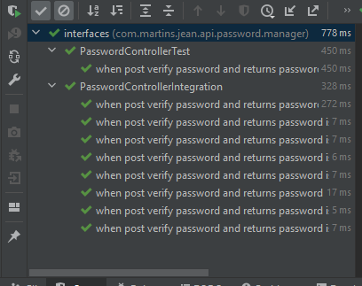

## Password Validator

    This api was built to manage a passwaords  that a password is valid, in which a password is passed in the request and the password 
    is verified through a bean custom validation.

### Project structure

    This project has a simple folder structure, so everyone that will work along on this project
    should understand at first look.

> controller -> Where our endpoint are located </br>
> validators -> Responsible for validating if a password is correct using a bean custom validation</br>
> json       -> Responsible to how the incoming data should be structured</br>
> exceptions -> Responsible for map an event that occurs during the execution of a program that disrupts the normal flow of instructions </br>
> resources  -> Has an application of config   </br>



### Showcase

**Execute the app using InteliJ or another smart IDE for java** </br>

- **When the app is running, run a POST method on Insomnia or Postman for the url: **http://localhost:8090/api/v1/password-manager/verify** using the following data:**

```json
{
  "password": "AbTp9!fok"
}
```

- **or you can import a curl**

```zsh
curl --location --request POST 'localhost:8090/api/v1/password-manager/verify' \
--header 'Content-Type: application/json' \
--data-raw '{
    "password":"AbTp9!fok"
}'
```

</br>

- **An example of how to make a request using Postman:** </br>


</br></br>

- **There are tests to ensure validation, and to prove that just run one of them on InteliJ as shown the image below:** </br>



